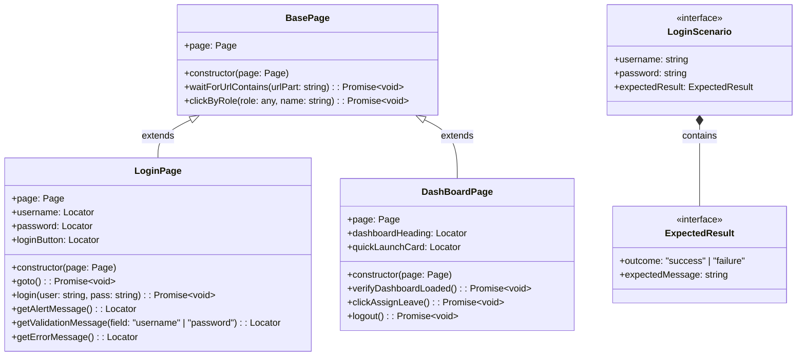

# Design Document

## orangehrm-login-automation

---

## Overview

This design describes the architecture, component structure, data models, and testing strategy for the OrangeHRM login automation suite. The suite validates the login and logout flows of `https://opensource-demo.orangehrmlive.com` using Playwright and TypeScript, following the Page Object Model (POM) pattern.

The implementation enhances the existing `LoginPage` and `DashBoardPage` classes, introduces a typed test data file, and adds a single comprehensive spec file (`tests/login.orangehrm.spec.ts`) that covers all 11 requirements. No changes are made to `playwright.config.ts` — screenshot capture on failure, Allure reporting, list reporting, and `forbidOnly` are already correctly configured.

### Goals

- Provide deterministic, order-independent test coverage for login/logout flows
- Keep test logic decoupled from test data via a typed TypeScript interface
- Enforce POM strictly — no raw Playwright locator calls in spec files
- Leverage existing Playwright configuration (screenshots, reporting, trace, workers)

---

## Architecture

The suite follows a layered architecture:

```
┌─────────────────────────────────────────────────────┐
│                  Spec Layer                          │
│         tests/login.orangehrm.spec.ts               │
│   (imports POM classes + test data; no raw locators) │
└───────────────────┬─────────────────────────────────┘
                    │ uses
        ┌───────────┴───────────┐
        ▼                       ▼
┌───────────────┐     ┌──────────────────┐
│  LoginPage    │     │  DashBoardPage   │
│  (enhanced)   │     │   (enhanced)     │
└───────┬───────┘     └────────┬─────────┘
        │ extends               │ extends
        └──────────┬────────────┘
                   ▼
           ┌──────────────┐
           │  BasePage    │
           └──────────────┘

┌─────────────────────────────────────────────────────┐
│              Test Data Layer                         │
│    tests/test-data/loginTestData.ts                 │
│  (LoginScenario interface + typed scenario array)   │
└─────────────────────────────────────────────────────┘
```

All spec files consume only the POM layer. The POM layer owns all selectors and user-interaction logic. Test data is owned by the data layer and imported directly into specs.

---

## Components and Interfaces

### File Structure Changes

```
playwright-automation/
├── pages/
│   ├── BasePage.ts              ← unchanged
│   ├── LoginPage.ts             ← ENHANCED (new methods added)
│   ├── DashBoardPage.ts         ← ENHANCED (logout() added)
│   └── ... (other pages, unchanged)
├── tests/
│   ├── test-data/
│   │   └── loginTestData.ts     ← NEW (typed test data file)
│   ├── login.orangehrm.spec.ts  ← NEW (comprehensive spec)
│   ├── login.spec.ts            ← unchanged (existing)
│   ├── login.advanced.spec.ts   ← unchanged (existing)
│   └── ... (other specs, unchanged)
├── playwright.config.ts         ← unchanged
└── tsconfig.json                ← unchanged
```

---

### Class Diagram



---

### Enhanced `LoginPage`

**File:** `pages/LoginPage.ts`

The existing class is enhanced with three new accessor methods. The `login()` method gains a post-click `waitForURL` guard so it resolves only after navigation settles (either to dashboard on success, or staying at `/` on failure — guarded by a short timeout).

```typescript
import { Page, Locator } from '@playwright/test';
import { BasePage } from './BasePage';

export class LoginPage extends BasePage {

  readonly username: Locator;
  readonly password: Locator;
  readonly loginButton: Locator;

  constructor(page: Page) {
    super(page);
    this.username    = page.getByRole('textbox', { name: /username/i });
    this.password    = page.getByRole('textbox', { name: /password/i });
    this.loginButton = page.getByRole('button',  { name: /login/i });
  }

  async goto(): Promise<void> {
    await this.page.goto('/');
  }

  /**
   * Fills credentials and submits the login form.
   * Waits for navigation to settle — either the dashboard URL or
   * a network-idle state indicating the app has responded with an error.
   */
  async login(user: string, pass: string): Promise<void> {
    await this.username.fill('');
    await this.username.fill(user);
    await this.password.fill('');
    await this.password.fill(pass);
    await Promise.all([
      this.page.waitForLoadState('networkidle'),
      this.loginButton.click(),
    ]);
  }

  /**
   * Returns the locator for the top-level "Invalid credentials" alert banner.
   * OrangeHRM renders this as a <p> inside a .oxd-alert-content div.
   */
  getAlertMessage(): Locator {
    return this.page.getByRole('alert');
  }

  /**
   * Returns the "Required" validation message locator beneath the specified field.
   * OrangeHRM renders validation spans directly after each input wrapper.
   *
   * @param field - 'username' or 'password' — selects which field's message to return
   */
  getValidationMessage(field: 'username' | 'password'): Locator {
    const inputLocator = field === 'username' ? this.username : this.password;
    // The validation span is the next .oxd-text--span sibling within the form group
    return inputLocator
      .locator('xpath=ancestor::div[contains(@class,"oxd-form-row")]')
      .locator('.oxd-text--span');
  }

  /**
   * Convenience alias — returns the alert locator for backward compatibility
   * with tests using `loginPage.errorMessage`.
   */
  getErrorMessage(): Locator {
    return this.getAlertMessage();
  }
}
```

**Design rationale:**
- `getAlertMessage()` targets `role="alert"` which is ARIA-correct and resilient to CSS changes
- `getValidationMessage()` walks up to the form row container then down to the validation span, keeping the locator anchored to the correct field without using fragile CSS selectors
- `login()` uses `Promise.all` with `waitForLoadState('networkidle')` instead of `waitForURL` because on failed login the URL does not change — the app simply re-renders the form
- The class extends `BasePage` to align with the project convention established in other POM classes

---

### Enhanced `DashBoardPage`

**File:** `pages/DashBoardPage.ts`

The existing class gains a `logout()` method. OrangeHRM uses a user avatar/profile dropdown in the top-right header that contains a "Logout" link.

```typescript
import { Page, Locator, expect } from '@playwright/test';
import { BasePage } from './BasePage';

export class DashBoardPage extends BasePage {

  readonly dashboardHeading: Locator;
  readonly quickLaunchCard: Locator;

  constructor(page: Page) {
    super(page);
    this.dashboardHeading = page.getByRole('heading', { name: 'Dashboard' });
    this.quickLaunchCard  = page.locator('div.oxd-grid-item', {
      has: page.getByText('Quick Launch'),
    });
  }

  async verifyDashboardLoaded(): Promise<void> {
    await expect(this.page).toHaveURL(/dashboard/);
    await expect(this.dashboardHeading).toBeVisible();
  }

  async clickAssignLeave(): Promise<void> {
    await this.page.getByRole('button', { name: 'Assign Leave' }).click();
  }

  /**
   * Opens the user profile dropdown and clicks Logout.
   * Waits for navigation back to the login page (URL: /) before resolving.
   */
  async logout(): Promise<void> {
    await this.page.getByRole('banner').getByRole('img', { name: /user profile/i }).click();
    await this.page.getByRole('menuitem', { name: /logout/i }).click();
    await expect(this.page).toHaveURL('/');
  }
}
```

**Design rationale:**
- The user avatar is inside `role="banner"` (the page header) — scoping the click prevents accidental matches elsewhere
- `getByRole('menuitem', { name: /logout/i })` is the ARIA-correct selector for dropdown menu items
- The method resolves only after the URL assertion passes, satisfying Requirement 9.3's "no hard waits" constraint

> **Note:** If the OrangeHRM avatar image lacks an accessible name at runtime, fall back to:
> `this.page.getByRole('banner').locator('li.oxd-userdropdown').click()`
> The tasks phase will confirm the correct selector against the live app.

---

## Data Models

### `LoginScenario` Interface

**File:** `tests/test-data/loginTestData.ts`

```typescript
export interface ExpectedResult {
  outcome: 'success' | 'failure';
  expectedMessage: string;
}

export interface LoginScenario {
  description: string;
  username: string;
  password: string;
  expectedResult: ExpectedResult;
}

export const loginScenarios: LoginScenario[] = [
  {
    description: 'Valid credentials',
    username: 'Admin',
    password: 'admin123',
    expectedResult: { outcome: 'success', expectedMessage: 'Dashboard' },
  },
  {
    description: 'Invalid username',
    username: 'NonExistentUser99',
    password: 'admin123',
    expectedResult: { outcome: 'failure', expectedMessage: 'Invalid credentials' },
  },
  {
    description: 'Invalid password',
    username: 'Admin',
    password: 'wrongpassword',
    expectedResult: { outcome: 'failure', expectedMessage: 'Invalid credentials' },
  },
  {
    description: 'Empty username',
    username: '',
    password: 'admin123',
    expectedResult: { outcome: 'failure', expectedMessage: 'Required' },
  },
  {
    description: 'Empty password',
    username: 'Admin',
    password: '',
    expectedResult: { outcome: 'failure', expectedMessage: 'Required' },
  },
];
```

**Design rationale:**
- `description` field makes parametrized test names readable in the Allure report
- `outcome: 'success' | 'failure'` is a union type, enforced at compile time, preventing typos
- The five mandatory scenarios satisfy Requirement 10.3 exactly
- Credentials are stored only in this file — spec files import and reference by variable, satisfying Requirement 10.2

---

## Error Handling

### Login Method Resilience

The `login()` method uses `waitForLoadState('networkidle')` rather than an unconditional `waitForURL`. This handles two distinct post-submit states:
- **Success**: the app navigates to `/dashboard` — URL changes, network settles
- **Failure**: the app re-renders the login page with an error — URL stays at `/`, network settles

Tests assert the resulting state explicitly via `expect(page).toHaveURL(...)` or `expect(locator).toBeVisible()` rather than relying on implicit waits.

### Logout Method Resilience

`logout()` ends with `await expect(this.page).toHaveURL('/')` rather than a `waitForNavigation`. If the profile menu selector does not match, Playwright will surface a descriptive timeout error pointing to the failing locator.

### Screenshot and Trace on Failure

These are delegated entirely to `playwright.config.ts`:
- `screenshot: 'only-on-failure'` — PNG captured automatically on any test failure
- `trace: 'on-first-retry'` — trace archive for CI retry debugging
- Output lands in `test-results/` (Playwright default) under a subdirectory named after the test

No custom `afterEach` screenshot code is needed in spec files. This satisfies Requirements 7.1 and 7.2 without adding maintenance burden.

### Validation Message Locator Fallback

If `getValidationMessage()` fails to locate the `.oxd-text--span` ancestor-based selector, the fallback locator strategy is:
```typescript
this.page.locator('.oxd-form-row:has(input[name="username"]) .oxd-text--span')
```
This is acceptable at the BasePage level for internal POM use (not in spec files).

---

## Testing Strategy

### Approach

This feature tests a live external web application. All acceptance criteria result in **integration tests** (live browser + live server) or **example-based unit/smoke tests** (configuration verification). Property-based testing is not appropriate here because:

- The code under test is the OrangeHRM application itself (external service), not a pure function in our codebase
- Test behavior does not vary meaningfully with random input — any invalid username produces the same "Invalid credentials" response
- Running 100 iterations of a live-server test would be costly, slow, and not find additional bugs

The testing strategy uses:
- **Integration tests** for all login/logout flows (Requirements 1–6)
- **Configuration smoke tests** verified by code review / static analysis (Requirements 7–11)

### Test File: `tests/login.orangehrm.spec.ts`

The spec is organized into `test.describe` blocks that map directly to requirements:

```
login.orangehrm.spec.ts
├── describe: Successful Login (Req 1)
│   ├── test: navigates to /dashboard on valid credentials
│   ├── test: shows Dashboard heading after login
│   └── test: shows no error elements after login
│
├── describe: Login Failure – Invalid Username (Req 2)
│   ├── test: shows "Invalid credentials" alert
│   ├── test: stays at URL /
│   └── test: retains username, clears password
│
├── describe: Login Failure – Invalid Password (Req 3)
│   ├── test: shows "Invalid credentials" alert
│   ├── test: stays at URL /
│   └── test: retains username, clears password
│
├── describe: Empty Username Validation (Req 4)
│   ├── test: shows "Required" beneath username field
│   └── test: stays at URL /
│
├── describe: Empty Password Validation (Req 5)
│   ├── test: shows "Required" beneath password field
│   ├── test: stays at URL /
│   └── test: retains username value
│
└── describe: Logout (Req 6)
    ├── test: navigates to / after logout
    ├── test: login form visible after logout
    └── test: unauthenticated redirect to /
```

Each `describe` block has a `beforeEach` that navigates to `/` and instantiates the POM objects, ensuring test isolation (Requirements 11.1 and 11.4).

The authenticated blocks (Req 1, Req 6 logout tests) perform a fresh `loginPage.login()` + URL assertion in `beforeEach` before each test's own actions proceed (Requirement 11.2).

### Test Independence

```typescript
test.describe('Successful Login', () => {
  let loginPage: LoginPage;
  let dashboardPage: DashBoardPage;

  test.beforeEach(async ({ page }) => {
    loginPage = new LoginPage(page);
    dashboardPage = new DashBoardPage(page);
    await loginPage.goto();                        // fresh navigation, no session assumed
  });

  // tests follow...
});
```

For logout tests, the `beforeEach` also performs login and asserts `/dashboard` before proceeding.

### Reporting

Both reporters are already active in `playwright.config.ts`:
- **Allure**: `allure-playwright` reporter generates `allure-results/` during the run; `allure generate` produces the HTML report in `allure-report/`
- **List**: prints per-test pass/fail/skip lines and a summary to stdout after the run

No additional reporter configuration is needed (Requirements 8.1 and 8.2).

### Screenshot Capture

`screenshot: 'only-on-failure'` in `playwright.config.ts` handles Requirements 7.1 and 7.2 automatically. Playwright writes screenshots to `test-results/<test-project>-<test-name>/test-failed-1.png`. No `afterEach` code is needed in spec files.

### Test Data

All credentials flow through `loginTestData.ts`. Parametrized tests iterate over `loginScenarios` using Playwright's `for...of` loop pattern (consistent with existing `login.spec.ts`). Named entries make Allure report test names descriptive.

### Locator Strategy Summary

| Element | Locator Method | Rationale |
|---|---|---|
| Username input | `getByRole('textbox', { name: /username/i })` | ARIA role + label |
| Password input | `getByRole('textbox', { name: /password/i })` | ARIA role + label |
| Login button | `getByRole('button', { name: /login/i })` | ARIA role + name |
| Dashboard heading | `getByRole('heading', { name: 'Dashboard' })` | Semantic heading |
| Profile menu trigger | `getByRole('banner').getByRole('img', { name: /user profile/i })` | Scoped ARIA |
| Logout menu item | `getByRole('menuitem', { name: /logout/i })` | ARIA menuitem |
| Alert message | `getByRole('alert')` | ARIA live region |
| Validation message | ancestor-traversal to `.oxd-text--span` | Closest reliable anchor |

All spec-level locator access goes through the POM methods — no raw `page.locator()` or `page.getByRole()` in spec files (Requirement 9.4).

---

## Correctness Properties

*A property is a characteristic or behavior that should hold true across all valid executions of a system — essentially, a formal statement about what the system should do. Properties serve as the bridge between human-readable specifications and machine-verifiable correctness guarantees.*

Since this is a test automation suite (not a pure-function library), the correctness properties below describe invariants that the suite itself must satisfy — they hold for every test, every run, and every input combination.

---

### Property 1: Login Outcome Determinism

*For any* (username, password) pair, invoking `loginPage.login(username, password)` must always produce the same observable outcome: if the credentials are valid, the browser URL must end with `/dashboard`; if the credentials are invalid or incomplete, the browser URL must remain at `/` and an error or validation message must be present.

**Validates: Requirements 1.1, 2.1, 2.2, 3.1, 3.2, 4.1, 4.2, 5.1, 5.2**

---

### Property 2: POM Encapsulation Invariant

*For any* spec file in the test suite, no direct Playwright locator API call (`page.locator()`, `page.$()`, `page.$$()`, `page.getByRole()`, `page.getByLabel()`, `page.getByPlaceholder()`) shall appear inline in a test body or `beforeEach` hook; all browser interactions must be expressed exclusively through `LoginPage` or `DashBoardPage` method calls.

**Validates: Requirements 9.1, 9.4**

---

### Property 3: Test Isolation

*For any* test T in the suite, executing T in isolation (as the only test in the run) must produce an identical pass or fail result as executing T as part of the full suite in any order. No test may depend on session state, cookies, or side effects produced by a prior test.

**Validates: Requirements 11.1, 11.2, 11.4**

---

### Property 4: Credential Non-Duplication

*For any* username or password string referenced in a test assertion or `beforeEach` setup, that string must originate from an import of `loginTestData.ts`; no spec file shall contain a hard-coded username or password literal inline within a test block or hook.

**Validates: Requirements 10.2, 10.3**

---

### Property 5: Error Message Completeness

*For every* failure scenario defined in `loginTestData.ts` (invalid username, invalid password, empty username, empty password), there must exist at least one test in the suite that asserts the specific `expectedMessage` value from that scenario against the corresponding on-page element returned by the `LoginPage` POM methods.

**Validates: Requirements 2.1, 3.1, 4.1, 5.1, 10.1, 10.3**
